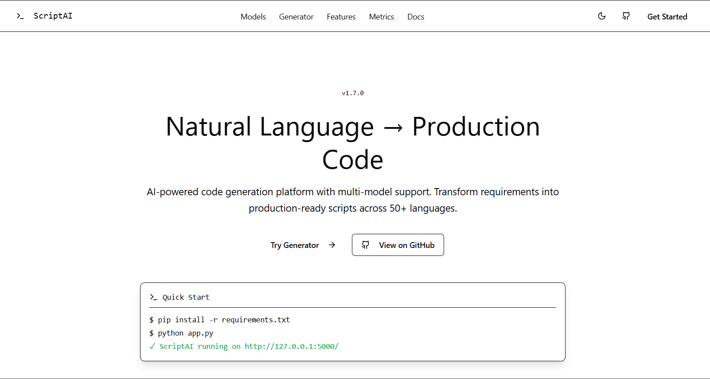

<div align="center">
  
  <h1>ScriptAI</h1>
  <p><strong>Generate production‑ready code from plain English — Web, API, CLI.</strong></p>
  <p>Provider‑agnostic, secure by default, observable, and extensible.</p>

  <p>
    <a href="#what-is-scriptai">What is ScriptAI?</a> •
    <a href="#quickstart">Quickstart</a> •
    <a href="#live-demo">Live Demo</a> •
    <a href="#features">Features</a> •
    <a href="#models--adapters">Models & Adapters</a> •
    <a href="#usage">Usage</a> •
    <a href="#api">API</a> •
    <a href="#api-error-reference">API Error Reference</a> •
    <a href="#security--observability">Security & Observability</a> •
    <a href="#architecture">Architecture</a> •
    <a href="#development">Development</a> •
    <a href="#plugin-development">Plugin Development</a> •
    <a href="#testing">Testing</a> •
    <a href="#license">License</a>
  </p>

  <p>
    <a href="https://scriptai-production.up.railway.app" target="_blank"><strong>Live Demo →</strong></a>
  </p>

  
</div>

[](https://github.com/qtaura/ScriptAI/actions/workflows/ci.yml)
[](https://codecov.io/gh/qtaura/ScriptAI)
[](LICENSE)
[](pyproject.toml)

---

## What is ScriptAI?

ScriptAI turns natural‑language requirements into working, production‑grade code. It includes:
- A modern React single‑page app for prompting and inspecting output.
- A robust Flask API with provider‑agnostic adapters (OpenAI, Anthropic, Gemini, HuggingFace, Local).
- A convenient CLI for batch or interactive workflows.

Built‑in guardrails (validation, sanitization, rate limiting), structured JSON logs with request IDs, and Prometheus metrics make it ready for teams and serious projects.

## Quickstart

Prerequisites
- Python `3.8+` and `pip`
- Optional for SPA development: Node.js `>=18`

1) Install dependencies
```
pip install -r requirements.txt
```

2) Configure credentials (optional; runs locally without them using the Local adapter)
```
copy .env.example .env   # on Windows
# then edit .env and set any of: OPENAI_API_KEY, HUGGINGFACE_API_KEY, ANTHROPIC_API_KEY, GOOGLE_API_KEY
```

3) Run the app
```
py -3 app.py   # Windows
# then open http://127.0.0.1:5000/
```

Notes
- On Vercel, the API is available under `/api/*` (e.g., `/api/generate`). Locally it’s at the root (e.g., `/generate`).
- The SPA is served at `/` by default.

## Live Demo

- Live URL: `https://scriptai-production.up.railway.app`
- API base (production): `https://scriptai-production.up.railway.app` (root). In Vercel deployments, use `/api/*`.
- Deploy notes: configure `OPENAI_API_KEY`, `HUGGINGFACE_API_KEY`, `ANTHROPIC_API_KEY`, `GOOGLE_API_KEY`, and optional `REQUEST_SIGNATURE_SECRET`.
- Local demo: run `py -3 app.py`. SPA dev server optional: `cd frontend && npm install && npm run dev` → `http://localhost:5174/`.

## Features
- Provider‑agnostic model adapters: OpenAI, Anthropic Claude, Google Gemini, HuggingFace, and a Local stub.
- Dynamic model registry: UI reads `modelCards.json` and intersects with server‑reported availability.
- Smart fallback chain: if a provider fails, configurable fallback attempts keep responses flowing.
- Strong guardrails: input validation, XSS sanitization, per‑IP rate limiting, strict JSON errors.
- First‑class observability: structured logs with `X‑Request‑ID`, Prometheus `/metrics`, and health/stats endpoints.
- Web, API, and CLI — use it your way.

### Differentiator: Explainable Smart Model Router
- Use `model: "auto"` to let the backend choose the best available provider based on prompt characteristics (length, language hints) and configured credentials.
- Add `"debug": true` in the request body (or `?debug=1` or header `X‑Debug‑Decision: 1`) to receive a human‑readable explanation and ranked candidates.
- Keeps your responses flowing with the existing fallback chain if the primary provider errors.

## Models & Adapters
- Built‑in adapters: `openai`, `anthropic`, `gemini`, `huggingface`, `local`.
- Availability: `GET /models` lists adapters whose `is_available()` checks pass based on configured API keys.
- Configuration: set `OPENAI_API_KEY`, `HUGGINGFACE_API_KEY`, `ANTHROPIC_API_KEY`, `GOOGLE_API_KEY` to enable providers.
- Fallback: set `ENABLE_FALLBACK=true|false` to control cross‑provider fallback.
- Custom adapters: drop Python files in `plugins/` or point `SCRIPT_AI_PLUGINS_DIR` to a folder. Implement a subclass of `model_adapters.ModelAdapter` and expose `register(register_adapter)`. See `plugins/hello_world_adapter.py` and `docs/plugins.md`.

## Usage

### Web (SPA)
- Open `http://127.0.0.1:5000/`, enter a prompt, choose a model, and generate code.
- Themeable, keyboard‑friendly UI with code highlighting.

### CLI
Interactive mode
```
python cli.py -i
```

Direct command
```
python cli.py "Create a Python quicksort" --model openai --file quicksort.py
```

Benchmark
```
python cli.py benchmark "Write a factorial function" --models all --iterations 3 --json
```

#### Tips
- Switch models in interactive mode: `model <id>` (openai, huggingface, anthropic, gemini, local).
- Privacy: use `--privacy` or `--stateless` to avoid config/history persistence and disable file logging.
- Save output: `save <filename>` in interactive mode, or `--file` in direct mode.
- Benchmark options: `--models`, `--iterations`, `--json`, `--save-csv <path>`.
- Resume logging: `--resume` appends to the previous CLI session (ignored in privacy/stateless mode).

## API

Base URL
- Local: `http://127.0.0.1:5000`
- Vercel: prefix endpoints with `/api` (e.g., `/api/models`)

Endpoints
- `GET /models` — Available model adapters based on configured credentials.
- `GET /model-profiles` — Categorical metadata for UI (speed, quality, cost, availability).
- `POST /generate` — Generate code.
  - Request:
    ```json
    { "prompt": "Build a function that validates emails", "model": "openai" }
    ```
  - Response:
    ```json
    { "code": "# generated code ...", "model_used": "openai" }
    ```
  - Auto‑routing example:
    ```json
    { "prompt": "Write a Python function to diff two dicts", "model": "auto", "debug": true }
    ```
    Response (truncated):
    ```json
    {
      "code": "def diff_dicts(a, b): ...",
      "model_used": "openai",
      "router": {
        "mode": "auto",
        "chosen": "openai",
        "reason": "python/sql hints; prioritize OpenAI/Anthropic",
        "candidates": ["openai", "anthropic", "huggingface", "gemini", "local"],
        "available": ["local", "openai"]
      }
    }
    ```
- `GET /health` — Health check.
- `GET /metrics` — Prometheus metrics (text exposition format).

Errors
- Standard JSON: `{ "error": "message" }` with appropriate HTTP status.

## API Error Reference
- `rate_limit_exceeded` — returns `429 Too Many Requests`; enforced per client IP.
- `adapter_error` — typically `502 Bad Gateway`; logged when a provider fails during generation or fallback.
- `unexpected_error` — returns `500 Internal Server Error`; for unhandled exceptions in routes.
- `upstream_error` — `502 Bad Gateway`; indicates upstream provider failure.
- `boom` — `500`; used only in tests to simulate an unhandled adapter exception.

Logged fields include `error_type`, `error_message`, `context`, and `request_id`. See `monitoring.py::MonitoringManager.log_error` for implementation details. For a deeper breakdown, check `docs/errors.md`.

## Security & Observability

Security
- Input validation, XSS sanitization, and per‑IP rate limiting (default `100/hour`).
- Security headers (CSP, frame/ content‑type protections) applied to all responses.
- Optional HMAC signatures (for external callers): set `REQUEST_SIGNATURE_SECRET` and send
  `X‑Signature: v1=<hex>` and `X‑Signature‑Timestamp: <epoch_seconds>` using base string
  `v1:{timestamp}:{body}` and HMAC‑SHA256.

Data privacy mode
- By default the app does not persist prompts or generations.
- Set `LOG_TO_FILE=false` to disable file logging entirely; logs will stream to console only.

Observability
- Structured JSON logs via `monitoring.JSONFormatter` with `request_id` propagation (`X‑Request‑ID`).
- Prometheus metrics at `/metrics` and lightweight usage/performance stats at `/stats` and `/performance`.

### Security Events
- `signature_missing_secret`, `signature_missing`, `signature_missing_timestamp` — `401 Unauthorized` when required config or headers are absent.
- `signature_bad_format` — `400 Bad Request` when the signature header format is invalid.
- `signature_bad_timestamp`, `signature_timestamp_out_of_window` — `401 Unauthorized` for invalid or stale timestamps.
- `signature_internal_error` — `500 Internal Server Error` if verification hits an internal failure.
- `signature_mismatch` — `401 Unauthorized` when HMAC does not match base string `v1:{timestamp}:{body}`.

Events are recorded via `SecurityManager.log_security_event(event_type, details, client_ip)`. See `security.py` for verification logic and examples.

## Configuration

Common environment variables (optional)
- `OPENAI_API_KEY`, `HUGGINGFACE_API_KEY`, `ANTHROPIC_API_KEY`, `GOOGLE_API_KEY` — enable providers.
- `ENABLE_FALLBACK=true|false` — turn cross‑provider fallback on/off (default on).
- `LOG_LEVEL` (default `INFO`), `LOG_TO_FILE=true|false`, `LOG_FILE_PATH`.
- `REQUEST_SIGNATURE_SECRET` (or `SIGNING_SECRET`) — enable request signing for external callers.

## Architecture

```
ScriptAI/
├── app.py                 # Flask app serving SPA and APIs
├── cli.py                 # Command‑line interface
├── frontend/              # React/Vite SPA (source for local dev)
├── static/figmalol/       # Built SPA assets served at '/'
├── tests/                 # Pytest suite (web + CLI)
├── security.py            # Validation, sanitization, signatures, rate limiting
├── monitoring.py          # Structured logging and Prometheus metrics
└── model_adapters.py      # Provider adapters and local generator
```

## Development

Run the Flask app (default SPA already built under `static/figmalol`)
```
py -3 app.py
```

Develop the SPA (optional)
```
cd frontend
npm install
npm run dev
```

## Plugin Development

- Drop Python files under `plugins/` or set `SCRIPT_AI_PLUGINS_DIR` to point at a folder.
- Implement an adapter by subclassing `model_adapters.ModelAdapter` and register it via `register_adapter` in a `register(register_adapter)` function.
- Registered adapters appear in `GET /models` when `is_available()` returns `true`.
- For a copy‑paste starter, see `plugins/hello_world_adapter.py` and the docs: `docs/plugins.md`.

## Testing
- Run tests: `py -3 -m pytest -q`.
- Black, MyPy, Flake8, and Bandit are configured for consistent quality.

## License
MIT — see [LICENSE](LICENSE).

---

<div align="center">
  <p>Developed with ❤️ by ScriptAI Team</p>
  <p>
    <a href="https://github.com/qtaura/ScriptAI/issues">Report Bug</a> •
    <a href="https://github.com/qtaura/ScriptAI/issues">Request Feature</a>
  </p>
</div>

## Security & Production Hardening

- Rate limiting
  - Flask-Limiter keys clients by the first IP in `X-Forwarded-For` (XFF) or `remote_addr`.
  - Server route now normalizes IP the same way, preventing bypass by changing secondary XFF entries.
  - Caveat: rotating the first IP (or true client IP) resets the bucket. Consider adding user-level keys (e.g., `X-User-Id`) for stricter multi-tenant control.

- Sanitization & validation
  - `SecurityManager.validate_prompt()` blocks script tags, event handlers (`on*=`), `javascript:`/`vbscript:`, iframes/embeds, and excessive repetition.
  - `SecurityManager.sanitize_input()` HTML-escapes content and strips script/JS/VB prefixes. HTML entity obfuscation is preserved as escaped text.
  - Caveat: ScriptAI does not execute generated code; adapters do not validate code outputs for runtime safety. Review outputs and run in trusted environments.

- Adapter security profiles
  - `OpenAI` — Strong outputs; no execution performed by ScriptAI. Outputs may include network/file/process operations; you must review before running.
  - `Anthropic` — Similar guarantees; strong reasoning, safe defaults; no output execution.
  - `Gemini` — Multi-modal; no output execution; treat generated code as untrusted until reviewed.
  - `HuggingFace` — Open models; variability in output quality; no output execution.
  - `Local` — Generates stub code only; no external calls. Caveat: does not validate code output; replace stubs carefully.

- Optional auth scaffolding
  - Set `AUTH_TOKEN` to enable simple token checks for non-GET requests.
  - Accepts `Authorization: Bearer <token>` or `X-API-Key: <token>`; sets `g.user_id` from `X-User-Id` when present.
  - Adjust the guard in `scriptai/web/auth.py` to protect GET routes if required.

- Optional request signing
  - Set `REQUEST_SIGNATURE_SECRET` (or `SIGNING_SECRET`) and send `X-Signature` and `X-Signature-Timestamp` headers. See `security.py` for the HMAC scheme and examples.
